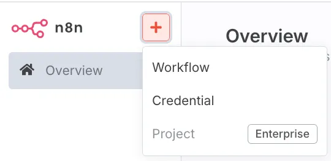
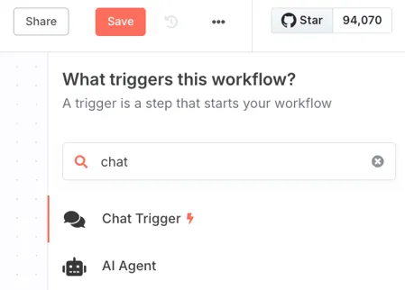

# Build Local AI Agents with n8n in Minutes
**Published: July 19, 2025**  
**Topic: n8n**

Welcome! In this tutorial, you’ll learn how to build AI agents using **n8n**—a robust workflow automation platform—and run them locally using Docker. We’ll cover what n8n is, how AI agents work, how to install n8n with Docker, and how to build your first intelligent automation with an AI agent and Airtable.

---

## 📌 What Is n8n?

n8n (pronounced “n-eight-n”) is a visual workflow automation tool that connects apps, services, and custom logic into seamless automations. It’s like Zapier or Make—but open-source and far more flexible.

---

## 🧠 Why Use AI Agents?

- Workflows are linear automations with predefined paths.  
- **AI Agents** use large language models (LLMs) like GPT to decide which tool to use dynamically, based on input and context.  
- **AI agents = smart automations** that can search databases, make decisions, and evolve in conversation.

---

## 💻 Step 1: Install n8n Locally Using Docker

To run n8n locally, you’ll need:

- Docker  
- A terminal (Command Prompt, PowerShell, or Terminal)

**🔧 Run n8n with Docker (Single Command):**

```bash
docker run -it --rm \
  -p 5678:5678 \
  -v ~/.n8n:/home/node/.n8n \
  -e N8N_BASIC_AUTH_ACTIVE=true \
  -e N8N_BASIC_AUTH_USER=admin \
  -e N8N_BASIC_AUTH_PASSWORD=your_password \
  n8nio/n8n
```

Access it at: [http://localhost:5678](http://localhost:5678)  
Login: `admin`  
Password: `your_password`

> 💡 **Pro Tip**: For a persistent local service, consider using a `docker-compose.yml` file. Let me know if you'd like that too.

---

## 🧱 Understand Node Types in n8n

Workflows in n8n are built using **nodes**, categorized as:

- **Trigger Nodes**: Start your workflow (e.g., chat message, webhook, schedule)  
- **Action Nodes**: Take actions in apps (e.g., send email, update Airtable)  
- **Utility Nodes**: Modify, transform, or route data  
- **Code Nodes**: Run custom logic (JavaScript, HTTP requests)  
- **AI Agent Node**: The smart brain powered by GPT or other LLMs

---

## 💬 Build a Local AI Agent Workflow

Once n8n is running locally:

### 1. Create a New Workflow

In the n8n UI:  
- Click **"Create Workflow"**
- 

### 2. Add a Chat Trigger

- Use the **“Chat Trigger”** node  
- This simulates a chatbot conversation in the UI
- 

### 3. Add an AI Agent Node

- Go to **Advanced AI → AI Agent**  
- 
- Connect it to a model like **GPT-4.0 from OpenAI**  
- 
- Add your OpenAI API key:

To get your API key:
- Visit: https://platform.openai.com/account/api-keys  
- Generate and paste into n8n under **Credentials**

---

## 🧠 Enable Memory for the Agent

Enable **Window Buffer Memory** in the AI Agent node to allow multi-turn conversation (e.g., track last five messages).

---

## 🔗 Connect Your Agent to Airtable (Optional Tool Example)

Let’s make the AI agent smarter by integrating Airtable:

### Step 1: Build an Airtable Base

Columns to include:
- Item Name  
- Quantity  
- Order Threshold

### Step 2: In n8n

Inside the AI Agent node:
- Add a Tool → **Airtable**  
- Operation: `Search` or `Update`  
- Authenticate with Airtable token (read/write/schema access)  
- Tool description: _"Searches my Airtable inventory."_

Example query the agent can now handle:
> “Is anything out of stock in my house?”

---

## 🔁 Chain Agents and Workflows

Scale your automation:

- Call other workflows from an agent  
- Create domain-specific agents (Inventory Agent, Calendar Agent)  
- Pass context/results between agents to build ecosystems

Example:
- One main AI Agent routes tasks to specialized agents based on input

---

## 🧪 Test the Agent Locally

Try phrases like:
- “I just bought two tubes of toothpaste.”  
- “What items are close to needing reordering?”  
- “Add three boxes of trash bags to my inventory.”

What n8n does:
- Understands the intent  
- Selects the right Airtable tool  
- Responds conversationally without hardcoding logic

---

## ✅ Summary: What You’ve Built

- ✅ n8n installed locally with Docker  
- ✅ A working AI agent powered by GPT  
- ✅ Memory-enabled conversation  
- ✅ Airtable integration for inventory  
- ✅ Foundation for agentic automation system

---

## 🚀 Want to Go Further?

This is just the beginning. You can:
- Add tools (Google Sheets, Notion, Gmail, etc.)  
- Use conditions, loops, filters, or vector search  
- Connect to APIs or hardware (home automation)

Let me know and I can help generate those for you too.

---

**What is your favourite large language model (LLM) that you have used?**

**Thanks for reading!**
